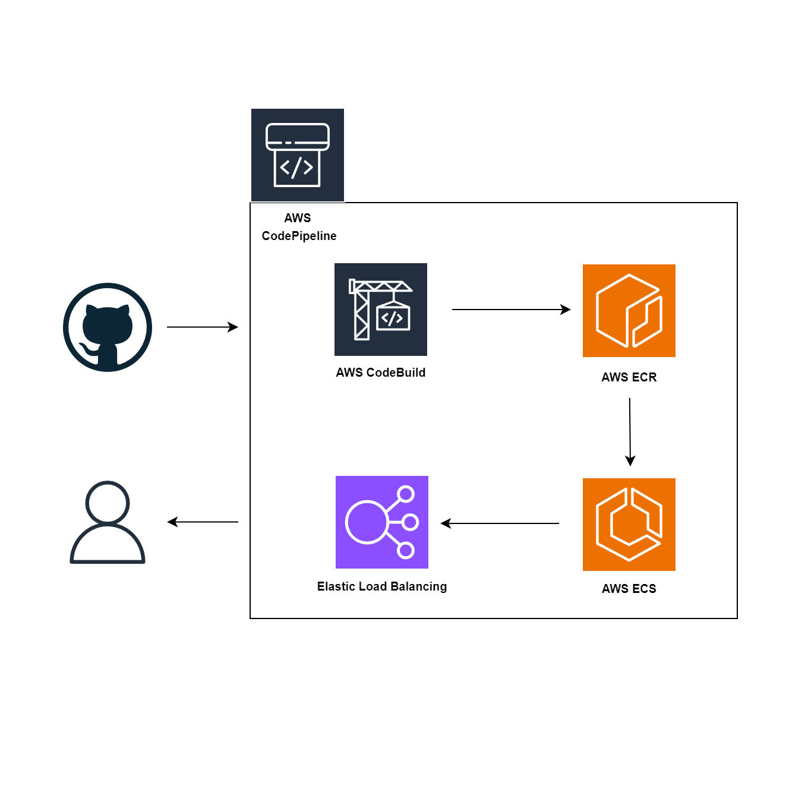

## Project Overview

This e-commerce application leverages the power of AWS cloud services to provide a scalable and reliable online shopping experience. The application's architecture is designed for efficient deployment and management, incorporating the following key components:

* **CI/CD Pipeline:** Automated deployment is facilitated by AWS CodePipeline, integrating CodeBuild for continuous integration, ECR for container image management and ECS for container orchestration.
* **Media Storage:** Amazon S3 is employed to securely store and manage media assets, ensuring optimal performance and scalability.
* **Database Management:** A relational database is hosted on AWS RDS, using PostgreSQL for robust data storage and retrieval.

**Deployment Process**

The deployment workflow follows these steps:
1. **Code Changes:** Developers commit changes to the source code repository.
2. **Build:** CodeBuild automatically builds the application, creating container images.
3. **Push to ECR:** The container images are pushed to Amazon ECR for storage and distribution.
4. **Deploy to ECS:** ECS deploys the updated container images to the production environment, ensuring a seamless transition.

